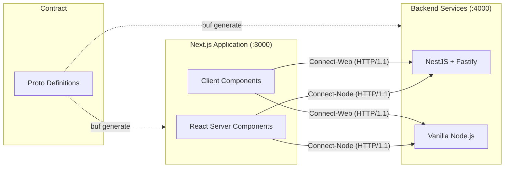

# Architecture

This project demonstrates the implementation of [Connect RPC](https://connectrpc.com/) with
ECMAScript across both backend and frontend environments, specifically highlighting Next.js 16
integration and strict end-to-end type safety.

## System Overview

The project is divided into three physical boundaries:

1. **Proto Definition (`proto/`)**: The single source of truth for service contracts and message
   formats using Protocol Buffers (`proto3`).
2. **Backend Services (`backend/`)**: Dual implementations of the services defined in the proto
   files. Both are configured to run on port `4000` (and must be run mutually exclusively).
   - `nestjs-fastify-platform`: A production-ready NestJS architecture using Fastify and strict
     Dependency Injection to link business logic to generated RPC schemas.
   - `vanilla`: A lean, framework-free implementation using standard `node:http`.
3. **Frontend Clients (`frontend/`)**: Modern web application built with Next.js 16 that consumes
   the backend services via both React Server Components (RSC) and interactive Client Components.

## Communication Flow

### The HTTP/1.1 Cleartext Constraint

During local development without TLS certificates, all communication between the frontend and
backend happens strictly over **HTTP/1.1** using the Connect protocol.

While Connect-RPC fully supports HTTP/2, modern web browsers categorically reject HTTP/2 cleartext
(`h2c`) connections via the `fetch` API. To ensure a frictionless local development experience
without requiring local SSL proxies, the backend servers are explicitly bound to standard HTTP/1.1,
which the Connect protocol handles seamlessly.

## Technology Stack

- **Transport**: Connect RPC (Protocol Buffers over HTTP/1.1 for local development)
- **Schema**: Protocol Buffers (proto3)
- **Backend**: TypeScript, NestJS 10, Fastify v5, `node:http`, Bun
- **Frontend**: Next.js 16, React 19, Tailwind CSS v4
- **Tooling**:
  - [Buf](https://buf.build/) for schema linting and deterministic code generation.
  - [Biome](https://biomejs.dev/) for fast code formatting and linting.
