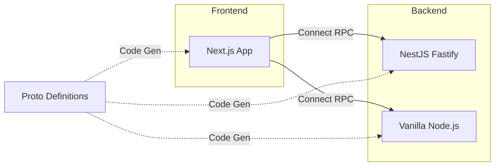

# Architecture

This project demonstrates the use of [Connect RPC](https://connectrpc.com/) with ECMAScript across both backend and frontend environments.

## System Overview

The project is divided into three main parts:

1.  **Proto Definition (`proto/`)**: The source of truth for service definitions and message formats using Protocol Buffers.
2.  **Backend Services (`backend/`)**: Implementations of the services defined in the proto file.
    -   `nestjs-fastify-platform`: A production-ready NestJS server using Fastify.
    -   `vanilla`: A lean implementation using standard Node.js/Bun.
3.  **Frontend Clients (`frontend/`)**: Modern web application built with Next.js that consumes the backend services via Connect RPC.

## Communication Flow

All communication between the frontend and backend happens over HTTP/2 or HTTP/1.1 using the Connect protocol (or gRPC/gRPC-Web).

## Technology Stack

-   **Transport**: Connect RPC (Protocol Buffers over HTTP)
-   **Schema**: Protocol Buffers (proto3)
-   **Backend**: TypeScript, NestJS, Fastify, Bun/Node.js
-   **Frontend**: Next.js, TypeScript, TailWind CSS
-   **Tooling**: [Buf](https://buf.build/) for linting and code generation, [Task](https://taskfile.dev/) for task automation.
