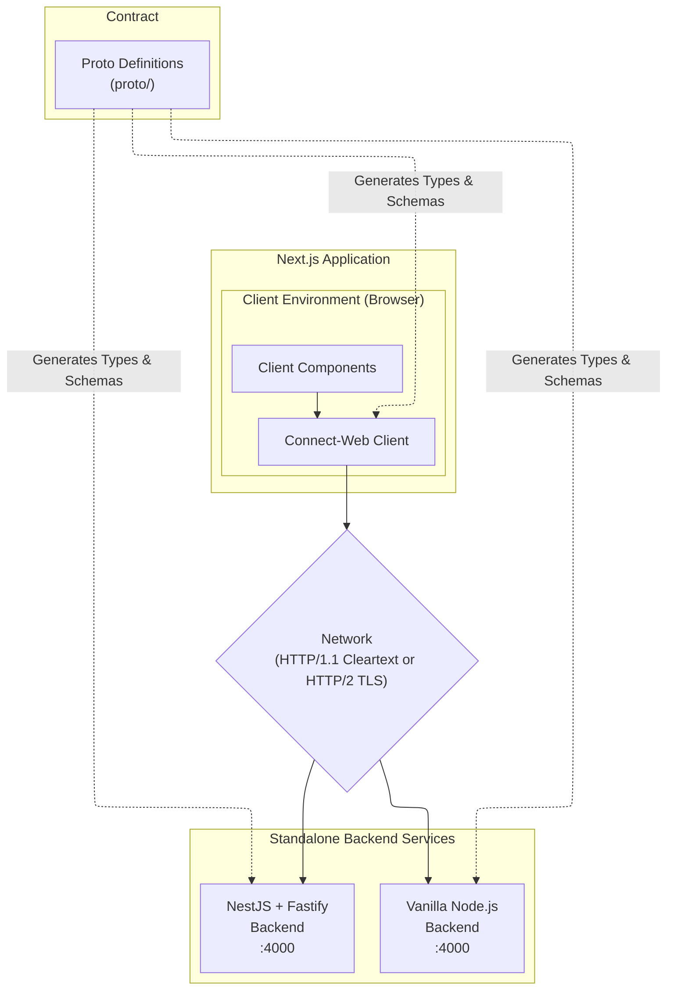

# Tools.

This repository serves as a comprehensive example and boilerplate for building modern, type-safe
APIs using **Connect RPC** with **ECMAScript (TypeScript)**. It demonstrates seamless integration
across both the backend (NestJS/Vanilla) and frontend (Next.js), providing a complete full-stack
solution for building RPC-based applications with excellent developer experience and type safety.

## Overview

This project provides a complete, production-ready template for building type-safe applications with
Connect RPC and ECMAScript. It demonstrates best practices for API design, code organization, and
developer experience optimization.

### What is Connect RPC?

Connect RPC is a modern RPC (Remote Procedure Call) framework that works seamlessly with Protocol
Buffers and provides an excellent developer experience with first-class TypeScript support.
Developed by the creators of protobuf-es, Connect RPC is designed to be the successor to gRPC,
offering better browser compatibility, richer error handling, and a simpler architecture.

Connect RPC supports multiple protocols including HTTP/1.1, HTTP/2, and the Connect protocol itself.
This flexibility allows it to work in various environments, from server-to-server communication to
browser-based applications.

### Why Connect RPC?

There are several compelling reasons to choose Connect RPC for your next project:

**Type Safety**: Connect RPC generates TypeScript code from Protocol Buffer definitions, providing
end-to-end type safety from your API definitions to your client applications. This eliminates an
entire class of runtime errors and makes refactoring safer and easier.

**Browser Compatibility**: Unlike gRPC, which requires gRPC-Web with a proxy, Connect RPC works
directly in browsers using HTTP/1.1 or HTTP/2. This simplifies deployment and reduces infrastructure
complexity.

**Rich Error Handling**: Connect RPC provides a sophisticated error model that includes error codes,
messages, details, and metadata. This makes error handling more structured and informative than
traditional HTTP status codes.

**Multiple Protocols**: Connect RPC supports unary RPCs, server streaming, client streaming, and
bidirectional streaming. This gives you flexibility in designing your API semantics.

**Modern Tooling**: The Connect ecosystem includes excellent tooling for code generation, linting,
and schema management through the Buf toolchain.

### Project Goals

This project aims to demonstrate:

1. **Best Practices**: Show how to structure and organize a Connect RPC project for production use.

2. **Type Safety**: Demonstrate end-to-end type safety from proto definitions to frontend
   components.

3. **Developer Experience**: Provide an excellent developer experience with hot reload, clear error
   messages, and comprehensive documentation.

4. **Flexibility**: Show how Connect RPC can be used with vastly different backend architectures
   (NestJS/Fastify vs Vanilla HTTP/1.1).

### Key Benefits

- **Single Source of Truth**: Protocol Buffer definitions serve as the single source of truth for
  API contracts.

- **Consistent API**: Both backend implementations expose the same API, enabling easy comparison and
  migration.

- **Modern Stack**: Built with the latest versions of popular frameworks and tools.

- **Well Documented**: Extensive documentation covering all aspects of the project.

---

## Architecture

### System Overview

The project follows a typical full-stack architecture with the following components:



### Communication Flow

The communication flow follows these steps:

1. **Definition Phase**: Developers define services and messages in `.proto` files.

2. **Generation Phase**: `buf generate` creates TypeScript code for both client (frontend) and
   server (backend).

3. **Implementation Phase**: Backend developers implement the service handlers.

4. **Consumption Phase**: Frontend developers use generated clients to call services.

5. **Transport Phase**: Connect RPC handles serialization, deserialization, and HTTP transport.

### Component Interactions

- **Frontend to Backend**: The frontend uses generated Connect RPC clients to make requests to
  backend services.

- **Between Backends**: Services can communicate with each other using the same Connect RPC
  protocol.

- **Client to Server**: All communication uses HTTP/1.1 by default to ensure browser compatibility
  without requiring local TLS certificates, utilizing the Connect protocol for encoding.

---

## Technology Stack

### Language & Runtime

- **TypeScript 5.x**: For static typing across backend and frontend. TypeScript provides
  compile-time type checking, better IDE support, and improved code maintainability.

- **Bun**: JavaScript runtime used for development and execution. Bun offers faster startup times
  and improved performance compared to Node.js. The project can also run with Node.js if preferred.

### Backend Technologies

- **NestJS v10**: Progressive Node.js framework for building efficient server-side applications.
  NestJS provides a clean architecture with dependency injection, modules, and a powerful CLI.

- **Fastify v5**: Low-overhead, high-performance HTTP server framework used as the NestJS adapter.
  Fastify is known for its excellent throughput and low memory usage.

- **Connect RPC**: Modern RPC implementation for TypeScript and Protocol Buffers. Connect RPC
  provides a clean API for implementing both unary and streaming RPCs.

- **Protocol Buffers**: Language-neutral, platform-neutral extensible mechanism for serializing
  structured data. Protocol Buffers offer efficient serialization and strong typing.

### Frontend Technologies

- **Next.js 16**: React framework for server-rendered and statically generated applications. Next.js
  16 includes the App Router, Server Components, and improved performance.

- **React 19**: UI library for building component-based interfaces. React 19 brings improved hooks,
  actions, and server components.

- **Tailwind CSS v4**: Utility-first CSS framework for rapid UI development. Tailwind enables quick
  styling without leaving your HTML.

- **Connect-Web Client**: For making type-safe API calls from interactive Browser Components.

### Tooling & DevOps

- **Buf**: Schema enforcement, linting, breaking change detection, and code generation for Protocol
  Buffers. Buf provides a modern replacement for protoc with better developer experience.

- **Biome**: Fast formatter, linter, and type checker for JavaScript/TypeScript.

---

## Project Structure

### Directory Overview

```
connectrpc-with-ecmascript/
├── proto/                        # Protocol Buffer definitions (source of truth)
├── backend/                      # Server-side implementations
│   ├── nestjs-fastify-platform/  # NestJS + Fastify backend
│   └── vanilla/                  # Minimal Node.js/Bun backend
├── frontend/                     # Next.js web application
├── .git/                         # Git version control data
├── README.md                     # This file
├── buf.yaml                      # Buf configuration
├── buf.gen.yaml                  # Buf code generation configuration
└── biome.jsonc                   # Biome formatter/linter configuration
```

### Proto Directory (`proto/`)

Contains the Protocol Buffer `.proto` files that define the service contracts and message types.
This directory is the single source of truth for the API.

```
proto/
├── counter/
│   └── v1alpha/
│       └── counter.proto   # Example service definition for a simple counter API
├── buf.yaml                # Buf CLI configuration (linting, breaking change detection, etc.)
└── buf.gen.yaml            # Buf code generation configuration
```

The proto directory contains:

- Service definitions (RPC methods)
- Message definitions (data structures)
- Import statements for shared types
- Configuration for code generation

### Backend Directory (`backend/`)

Holds two distinct implementations of the services defined in the proto files.

#### NestJS Fastify Platform (`backend/nestjs-fastify-platform/`)

A production-ready backend built with NestJS framework and Fastify adapter. Features include:

- Module-based architecture
- Strict Dependency Injection linking business logic to RPC schemas
- Seamless Fastify integration via `@connectrpc/connect-fastify`
- Native CORS management
- End-to-end type safety derived directly from Protobuf schemas

#### Vanilla Implementation (`backend/vanilla/`)

A minimal, lightweight backend using plain Node.js/Bun with the Connect RPC library directly.
Demonstrates:

- Direct usage of Connect RPC without framework abstractions
- Manual request handling
- Simple service implementation
- Reduced dependencies and faster startup

### Frontend Directory (`frontend/`)

A Next.js 16 application that consumes the backend services via Connect RPC clients.

- Type-safe generated client code (`@connectrpc/connect-web`)
- Client Components for interactive browser-side RPC execution
- Suspense boundaries for non-blocking asynchronous data fetching
- Tailwind CSS v4 for styling

---

## Getting Started

### Prerequisites

Ensure you have the following installed:

- **Bun** (version 1.1 or later): Used as the primary package manager and runtime.
  - Verify installation: `bun --version`
  - Installation: Visit [bun.sh](https://bun.sh/) for platform-specific instructions.

- **Buf** (version 1.20 or later): For protobuf linting and code generation.
  - Verify installation: `buf --version`
  - Installation: Visit [buf.build/install](https://buf.build/install) for platform-specific
    instructions.

- **Git** (any recent version): For version control.
  - Verify installation: `git --version`

> **Note**: While Bun is used in this project, the backend services can also run with Node.js
> (version 18 or later) if preferred. Adjust `bun` commands to `npm` or `yarn` accordingly.

### Installation

1. **Clone the repository**:
   ```bash
   git clone https://github.com/your-username/connectrpc-with-ecmascript.git
   cd connectrpc-with-ecmascript
   ```

2. **Install dependencies** for all workspaces:
   ```bash
   # Install root-level dependencies (if any) and workspace dependencies
   bun install
   ```

   This will install dependencies for:
   - Root directory (tooling like Buf, Task)
   - `backend/nestjs-fastify-platform`
   - `backend/vanilla`
   - `frontend`

### Code Generation

The project uses Buf to generate TypeScript code from Protocol Buffer definitions. This step must be
run after any changes to `.proto` files.

```bash
task contract:generate
```

<<<<<<< HEAD

## Start up frontend.

```bash
bun run dev
```

## Start up backend (of your choice).

```bash
bun run start
```

======= Generated code will be placed in the respective `src/gen/` directories of the backend and
frontend services, as specified in `buf.gen.yaml`.

### Running the Backend

You can run either or both backend implementations.

#### NestJS Fastify Platform

```bash
cd backend/nestjs-fastify-platform
bun install          # Install dependencies
bun run start        # Start the application
```

The NestJS server will be available at `http://localhost:4000` by default. Note: Run only one
backend at a time to avoid port collisions.

#### Vanilla Implementation

```bash
cd backend/vanilla
bun install          # Install dependencies
bun run start        # Start the server
```

The vanilla server will be available at `http://localhost:4000` by default. Note: Run only one
backend at a time to avoid port collisions.

### Running the Frontend

```bash
cd frontend
bun install          # Install dependencies
bun run dev          # Start Next.js development server
```

The frontend will be available at `http://localhost:3000` by default.

### Verification

Once everything is running (one backend + frontend):

1. **Frontend App**: Visit `http://localhost:3000/1` in your browser to interact with the Next.js
   Client Component.
2. **Backend RPC Target**: The backends automatically mount the Protobuf services based on their
   package paths. For example, the `IncreaseCounter` method is available via HTTP POST at:
   `http://localhost:4000/counter.v1alpha.CounterService/IncreaseCounter`.

>>>>>>> 392bbac (docs(readme): simplify and refresh project documentation)
